# 📦 SGT5 Bootstrap Installer

Welcome!
This is the **official installation wizard** for setting up the SGT5 system on your server or local environment.

This repository is designed to simplify the installation process, even for users without deep technical knowledge.

---

## 📑 Table of Contents

* 🚀 [Installation](#-installation)
* 🛠️ [What You Need](#️-what-you-need)
* 📖 [Remote Setup with VS Code](#remote-setup-with-vs-code)

---

## 🚀 Installation

To begin, open your terminal and run the following command **in an empty folder**:

```bash
/bin/bash -c "$(curl -fsSL https://raw.githubusercontent.com/psmty/sgt5-install/main/install.sh)"
```

That’s it! 🎉
The script will:

* Ask for your GitHub token to access the private installation files
* Automatically download and prepare the system
* Start an easy-to-follow setup wizard

> **Important:** The script might require a restart after the first run. After rebooting, simply run the script again to complete the setup.

> ⚠️ **If the installation is interrupted** for any reason (e.g. network failure, manual stop), you can safely re-run the above installation command.
> Alternatively, if the environment is already prepared, you can resume the setup by running:
>
> ```bash
> sgt5 -i
> ```

---

## 🛠️ What You Need

* A GitHub account with access to the private SGT5 repository
* A valid **GitHub Personal Access Token (PAT)**
* A **Linux environment** (Ubuntu recommended)
* An **empty folder** to begin installation

---

## 📖 Remote Setup with VS Code

> This section explains how to connect to your server using Visual Studio Code’s Remote SSH feature and prepare your environment for SGT5 installation.

### 1. Download Visual Studio Code

Download and install Visual Studio Code from [https://code.visualstudio.com/](https://code.visualstudio.com/).

### 2. Install Remote Extensions

Open the Extensions panel (from the left sidebar), type `remote`, and install:

* **Remote – SSH**
* **Remote Explorer**

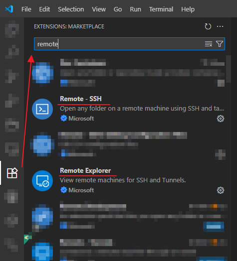

---

### 3. Configure SSH Connection

1. Open the **Remote Explorer** panel on the left.

2. Click the **“+”** icon next to SSH.

    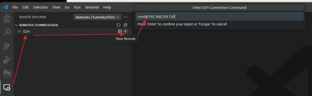

3. Enter your SSH connection string in the following format:

   ```
   username@server-ip
   ```

4. Choose the file to save your SSH settings (by default, select the `.ssh/config` inside your user profile).

    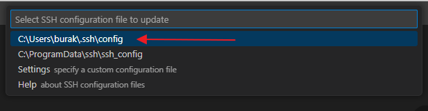

---

### 4. Connect to the Server

* A notification will appear at the bottom right. Click **“Connect”**.

    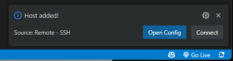

* If this is your first time connecting, you may see a certificate warning. Click **“Continue”** to trust the certificate and proceed.

    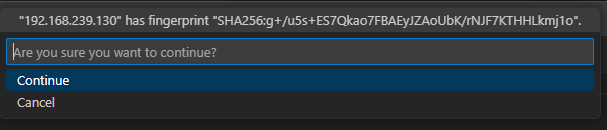

* Enter your SSH user password when prompted.

    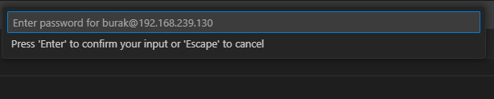

### 5. Wait for VS Code Server Installation

* VS Code will install a server application on your remote machine.
* You can monitor the progress in the notifications area at the bottom right.

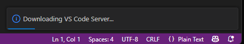

### 6. Open the Root Folder

1. Once connected, click **Open Folder**.
2. In the dialog, enter `/` and click **OK**.
3. You may be prompted for your password again.

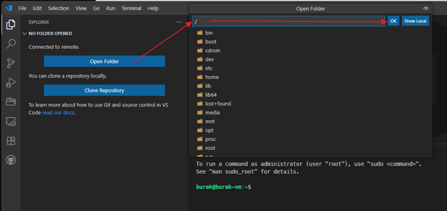

### 7. Create the `sgt5` Folder

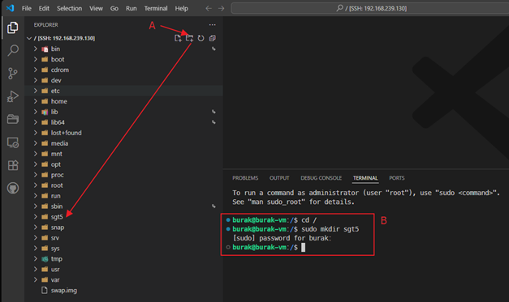

* **Method A:**
  If you have permission, click the **new folder** icon in the left panel and create a folder named `sgt5`.

* **Method B:**
  If you need elevated permissions, open the **Terminal** (from the top menu: `Terminal` → `New Terminal`) and run:

  ```sh
  sudo mkdir /sgt5
  ```

  Enter your password if prompted.

* Make sure the `sgt5` folder appears in the folder list on the left.

### 8. Open the `sgt5` Folder in VS Code

1. Go to the top menu and select **File** → **Open Folder**.

    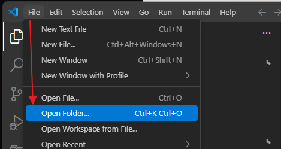

2. Type `/sgt5`, select the `sgt5` folder from the list, and click **OK**.

    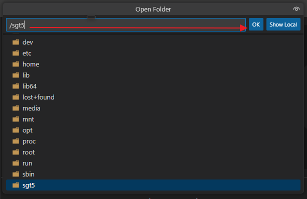

3. Enter your password again if prompted.

* You should now see the `sgt5` folder open in the left panel.

### 9. Open a Terminal

* If the **Terminal** is not already open, select it from the top menu: `Terminal` → `New Terminal`.

### 10. Run the Installation Command

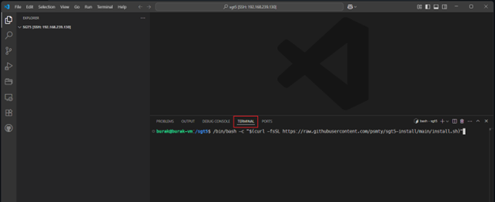

Paste the following command into your terminal (replace the URL with the actual installer link if necessary):

```bash
/bin/bash -c "$(curl -fsSL https://raw.githubusercontent.com/psmty/sgt5-install/main/install.sh)"
```

* Follow the steps in the installer.
* Depending on your system and installed packages, you might need to restart your server once. The installer will notify you if a reboot is required.

---

**That’s it!**
Your SGT5 environment should now be ready.
